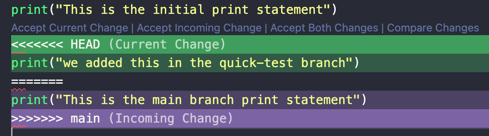
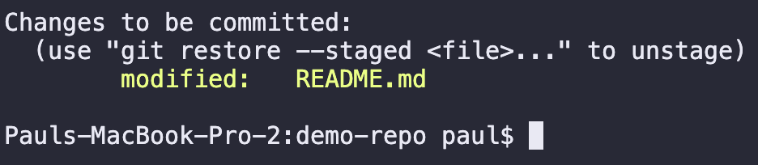
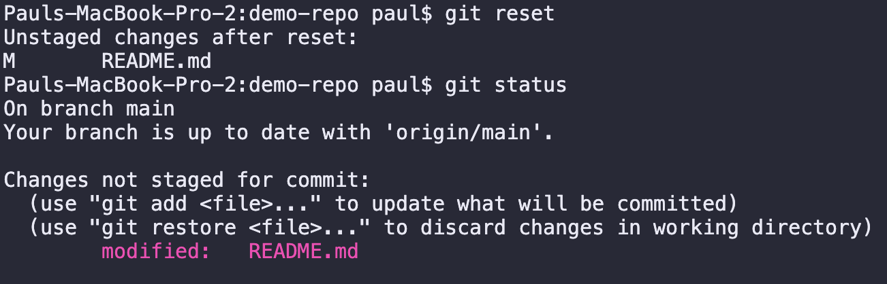
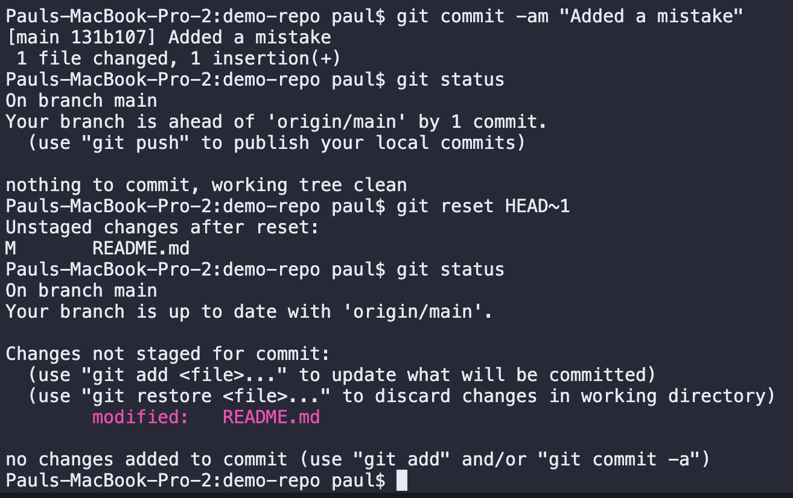
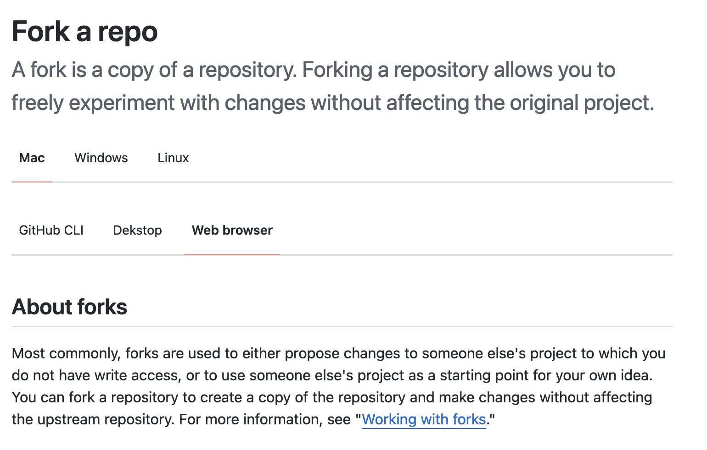
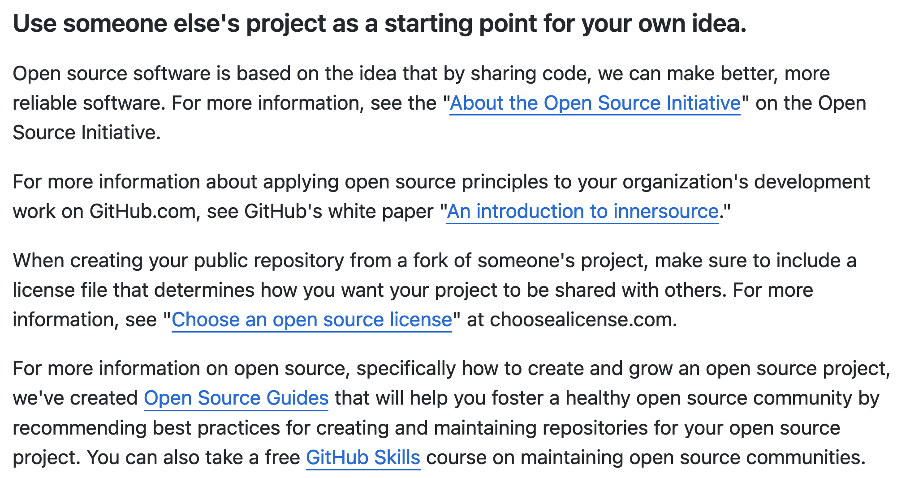
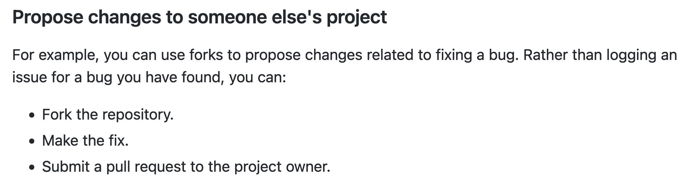

# GitHub

> Directory I’m working in: `/Users/paul/Documents/Personal Projects/git_demo`  
[What is GitHub?](https://www.youtube.com/watch?v=w3jLJU7DT5E)  
[Getting Started with Git](https://docs.github.com/en/get-started)  
[Git and GitHub for Beginners - Crash Course](https://www.youtube.com/watch?v=RGOj5yH7evk&t=1s)  
[Demo Repo (used for this tutorial)](https://github.com/pl8nt/demo-repo)  
————————————————————————  
[Connecting to GitHub with SSH](https://docs.github.com/en/authentication/connecting-to-github-with-ssh)  
&nbsp;&nbsp;&nbsp;&nbsp;[Generating a new SSH key and adding it to the ssh-agent](https://docs.github.com/en/authentication/connecting-to-github-with-ssh/generating-a-new-ssh-key-and-adding-it-to-the-ssh-agent)  
&nbsp;&nbsp;&nbsp;&nbsp;[Adding a new SSH key to your GitHub account](https://docs.github.com/en/authentication/connecting-to-github-with-ssh/adding-a-new-ssh-key-to-your-github-account)  
&nbsp;&nbsp;&nbsp;&nbsp;[How to Add SSH Keys to Your GitHub Account](https://www.inmotionhosting.com/support/server/ssh/how-to-add-ssh-keys-to-your-github-account/)
[Forking a Repo](https://docs.github.com/en/get-started/quickstart/fork-a-repo)  
[How to Set Upstream Branch on Git](https://devconnected.com/how-to-set-upstream-branch-on-git/)  
[How to Delete a Git Branch Both Locally and Remotely](https://www.freecodecamp.org/news/how-to-delete-a-git-branch-both-locally-and-remotely/)  
[How to push new Git branches to remote repos on GitHub or GitLab by example](https://www.theserverside.com/blog/Coffee-Talk-Java-News-Stories-and-Opinions/git-push-new-branch-remote-github-gitlab-upstream-example)  
[How to Enable Git Tab Autocomplete on Your Mac](https://www.macinstruct.com/tutorials/how-to-enable-git-tab-autocomplete-on-your-mac/)  
[GitHub Hosting Your Websites - GitHub Pages](https://pages.github.com/)
> 

---

- Table of Contents

# Basic Terminology

## What is Git?

- Git → free and open source version control system.

### What is Version Control?

- The management of changes to documents, computer programs, large web sites, and other collections of information.
- A way that programmers track code changes → basically save an initially version into Git and then when we update code, we can save it to Git
    - We are able to see all the changes that we’ve made over time.

## What is a repository?

- Repository → refers to a git repository which just represents your project or the folder which contains your project

## Git vs GitHub

- Git → tool that tracks changes in code over time
- GitHub → website that hosts all your git repositories n

# Basic Git Commands

These are **typed into the terminal / CL.**

- `git clone` → bring a repository that is hosted somewhere like GitHub into a folder on your local machine
- `git add` → track your files and changes in Git
- `git commit` → save your files in Git (committing your changes)
- `git push` → upload Git commits to a remote repo, like GitHub (these uploads your files to a remote repo)
- `git pull` → download changes from remote repo to your local machine, the opposite of push (download changes from remote repo to local machine)
- `git status` → shows all files that were updated / created / deleted but **haven’t been save in a commit yet**
- `git fetch` → downloads commits, files, and refs from a remote repo into your local repo → **fetching is what you do when you want to see what everybody else has been working on** (more info [here](https://www.atlassian.com/git/tutorials/syncing/git-fetch))

# Seeing What Version of Git is Installed on Local Computer

If on Mac or Linux, git is installed by default.

```bash
git --version
```

# Pulling a Repo from GitHub to Local System

Using the terminal, we can clone the repo into the current directory that we are working in.

```bash
git clone <ssh-for-repo>
```

# How to know if you’re in a Git Repo?

There should be a `.git` hidden directory when running the command below

```bash
ls -la 
```

# git status: Untracked and Modifications

- We are going to create a new file titled [`example.py`](http://example.py) in the directory.
    - Upon using the `git status` command, we are able to see any changes to files that have existed but **also see any untracked files that were created after the cloning of the repo.**
        - In order to get Git to start tracking the file, we must use the `git add` command and specify which file(s) to add
        
        ```bash
        git add <new-file-name>
        
        or more commonly
        
        git add .
        => tells git to track all the files listed in the current directory
        ```
        
    - After adding all the untracked/modified/deleted files with `add` we are now finally able to **commit!**

# git commit: Committing Our Changes

```bash
git commit -m "message-here" [-m "some-desc"] [optional for desc]

-m => inclusion of a message (which is required) (tells the what and why of the commit we are making)
```

**Shortcut**: `git add` and `git commit` at same time

```bash
git commit -am "message"

* only works for modified files, **not newly created files.**
```

# git push: The Changes aren’t Live Yet on GitHub

The commit **isn’t live on GitHub yet,** we must **use the `git push` →** push this live to a remote repo where my project is hosted (GitHub) in our case.

```bash
git push origin main

git push origin <branch>

origin => word that stands for the location of our git repo
main => the branch that we want to push to
```

# Establishing a Repo Locally and Push it to a Remote Repo on GitHub

- I created a new titled `README.md` in the `demo-local-to-repo` directory.
    - Say we want to push this to GitHub despite it not having a dedicated remote repo.
1. First, use `git init`
2. Then, use `git add` to have git track these files ⇒ prepares for a commit
3. Finally, use `git commit -m “.”`
- What if we wanted to push this live, upon using `git push origin main` ⇒ git doesn’t know where to push it to, **we must create an empty repo on GitHub and copy the ssh again.**
    - We must use `git remote` ⇒ use this to add a reference to the remote repo.

## git remote: Adding a Reference to a Remote Repo for a Local Project

```bash
git remote add origin <ssh-to-empty-repo>
```

# GitHub Workflow

Comparing adding code in the GitHub interface vs writing it locally.

## GitHub Interface Workflow

### Write code

### commit changes

### make pull request

## Local Git Workflow

### Write Code in editor

### git add (stage changes)

```bash
git add <file(s)> or git add .
```

### git commit (commit changes)

```bash
git commit -m "message" [-m "description"]
```

### git push (push changes)

```bash
git push origin <branch-name>
```

### make pull request

# Git Branching

## What is Git Branching?

- main: default branch in a repo
- We are able to **create new branches → changes made in a new branch are only seen in the branch and not in the other branches.**
    
    

- Say we have an app that’s running on the main branch, we want to establish a “sandbox” branch to write code that may break so we can figure out what code we need to write and then when we are finally done, we can merge it to the main branch.

## Branching in the Command Line

### Showing what branches exist for this repo

```bash
git branch

the * being next to a branch indicates which branch you are currently on
i.e:
* main
```

### Switching between branches and creating new branches

```bash
git checkout <branch-name> // used to switch branches

git checkout -b <branch-name> // used to create a new branch

git switch -c <branch-name> // used to create a new branch
```

### Depending on the branch that we are in, we see live changes in our files in VSCode!

### git diff: Shows what changes have been made (compares two versions of the code)

```bash
git diff
```

### git merge: Merges in the changes

But we don’t really directly use merge, typically developers push these changes on that branch up to GitHub and then making a pull request.

### Specifying the branch that we want to push to

```bash
git push --set-upstream origin <branch-name>

OR

git push --u origin <branch-name> (shorter!)
```

# What is a Pull Request?

- A request to have our code pulled into another branch.
    - In our case, we created a feature branch and we want to pull that code into the main branch.

# git pull: Pulling changes into local repo

If the upstream has already been set, use

```bash
git pull
```

If there is no upstream set, you can do this to set it

```bash
git push -u origin <branch>
```

# Deleting a Branch

## Deleting Local Branches

- It’s common to delete branches that have already been merged into the main branch
    - You don’t really reuse branches that have been merged.

```bash
git branch -d <branch-name>
```

## Deleting Remote Branches

- All because you delete a branch that exists on your local computer doesn’t mean that it’s deleted in the GitHub Repo. In order to do this:

```bash
git push <remote> :<branch>

i.e:
git push origin :quick-test
```

# Merge Conflicts

- If there are two people working on the same file(s) → Git isn’t sure which code to keep and which code to get rid of, etc.

Reference [here](https://youtu.be/RGOj5yH7evk?t=2947) if more info needed.

- As changes are made into `main` in the GitHub repo, we want to pull those down to your local `main` branch.
    
    ```bash
    git merge main -> will display any merge conflicts
    ```
    
    
    

# Undoing in Git

- What if we made a mistake? (i.e: accidentally committed something to git)

## Undoing a git add

Say we added this line into the `README.md` file (red highlight)

```markdown
## Local Development
1. Hello, I have edited this on the GitHub interface and am testing that it appears on my local machine via a git pull command.
2. This is a mistake!
```

and then we added it with `git add`

```bash
git add README.md
```

upon doing `git status`, we can see these changes have been “staged”



To “unstage” these changes, we simply do

```bash
git reset
```



## Undoing a git commit

```bash
git reset HEAD~1
```



## Seeing a log of commits

```bash
git log
```

## Going back to a certain commit

```bash
**HERE WE HAVE A SPECIFIC COMMIT'S HASH**
commit 713f7be46c41114b434e4a8830caee956c3988b8 (HEAD -> main, origin/main, origin/HEAD)

**TO GO BACK TO CERTAIN COMMIT, SIMPLY DO THIS**
git reset <commit-hash>

i.e:
git reset 713f7be46c41114b434e4a8830caee956c3988b8
```

### Having the files updated when going back to a certain commit

```bash
git reset --hard <commit-hash>
```

Now the changes won’t just be unstaged but will also be completely removed from the files.

# Forking a Repo



- Find a repo that you want to fork and look at the top-right


## Why would you want to fork?

- Use someone else’s project as a starting point for your own idea.
    
    
    
- Propose changes to someone else’s project
    
    